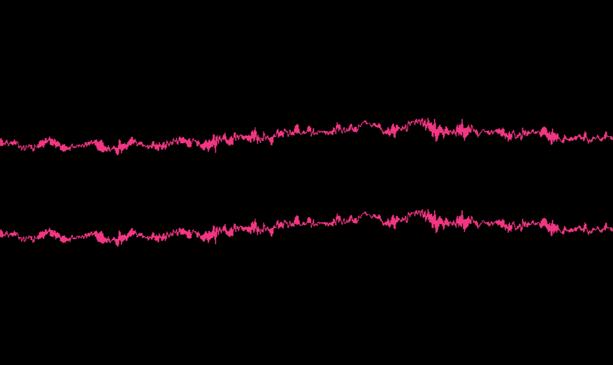

# ProjectM - visualization

* villa: inspired by an processing-application from @friedrichweise

good documentations links:

* [Winamp-doc](http://wiki.winamp.com/wiki/MilkDrop_Preset_Authoring)
* [Milkdrop](http://www.geisswerks.com/milkdrop/milkdrop_preset_authoring.html) (Backup-Link)
* [Milkdrop-Website](https://archive.fo/exkT) (Archive-Link)

